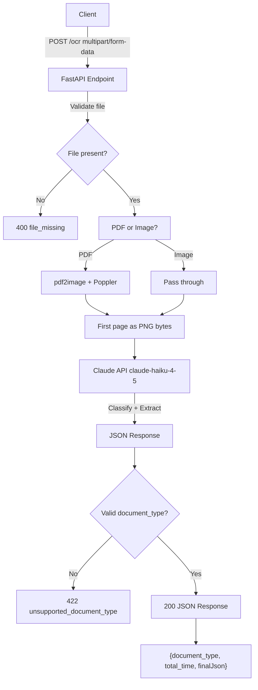

# Fullerton Health OCR API

A FastAPI-based REST service that accepts healthcare document uploads (PDF or image),
classifies them into one of three document types, and extracts structured fields using
Claude (Anthropic).

---

## Architecture



**Technology Stack:**
- **Framework:** FastAPI
- **PDF Processing:** pdf2image + poppler-utils
- **LLM Provider:** Anthropic Claude (claude-haiku-4-5-20251001)
- **Containerisation:** Docker + docker-compose

---

## Document Types

| Type | Fields |
|---|---|
| `receipt` | claimant_name, claimant_address, claimant_date_of_birth, provider_name, tax_amount, total_amount |
| `medical_certificate` | claimant_name, claimant_address, claimant_date_of_birth, diagnosis_name, discharge_date_time, icd_code, provider_name, submission_date_time, date_of_mc, mc_days |
| `referral_letter` | claimant_name, provider_name, signature_presence, total_amount_paid, total_approved_amount, total_requested_amount |

---

## Setup

### Prerequisites

- Python 3.12+
- Poppler (for PDF to image conversion)

### Installation

```bash
git clone <repo-url>
cd fullerton-health-assessment
```

### Local Development

```bash
bash setup.sh
```

```bash
cp .env.example .env
```

# Option 1: Use dev.sh (auto-finds available port if 8000 is in use)
```bash
./dev.sh
```

# Option 2: Manual start
```bash
source .venv/bin/activate
```

```bash
uvicorn src.api:app --reload
```

### Docker

```bash
cp .env.example .env
```

# Default port 8000
```bash
docker compose up --build
```

# Or use a different host port if 8000 is in use
```bash
HOST_PORT=8001 docker compose up --build
```

---

## API Reference

### POST /ocr

**Request**

# Upload a document for classification and extraction
```bash
curl -X POST http://localhost:8000/ocr \
  -F "file=@data/raw/receipt.pdf" | jq .
```

**Success Response (200)**

```json
{
  "document_type": "receipt",
  "total_time": 6.1,
  "finalJson": {
    "claimant_name": "JOHN DOE",
    "claimant_address": "123 SAMPLE ST #01-01",
    "claimant_date_of_birth": "01/01/1980",
    "provider_name": "Raffles Medical",
    "tax_amount": 3.65,
    "total_amount": 49.25
  }
}
```

**Error Responses**

| Status | Body | Trigger |
|---|---|---|
| 400 | `{"error": "file_missing"}` | No file uploaded |
| 422 | `{"error": "unsupported_document_type"}` | Document type not recognised |
| 500 | `{"error": "internal_server_error"}` | Unhandled exception |

---

## Test Results on Sample Documents

### Receipt (`data/raw/receipt.pdf`)

**Processing Time:** 6.1 seconds | **Classification:** `receipt`

```json
{
  "document_type": "receipt",
  "total_time": 6.1,
  "finalJson": {
    "claimant_name": "JOHN DOE",
    "claimant_address": "123 SAMPLE ST #01-01",
    "claimant_date_of_birth": "01/01/1980",
    "provider_name": "Raffles Medical",
    "tax_amount": 3.65,
    "total_amount": 49.25
  }
}
```

### Medical Certificate (`data/raw/medical_certificate.pdf`)

**Processing Time:** 5.02 seconds | **Classification:** `medical_certificate`

```json
{
  "document_type": "medical_certificate",
  "total_time": 5.02,
  "finalJson": {
    "claimant_name": "JOHN DOE",
    "claimant_address": "123 SAMPLE ST #01-01",
    "claimant_date_of_birth": "01/01/1980",
    "diagnosis_name": "Upper respiratory tract infection",
    "discharge_date_time": "30-Nov-2022 14:30",
    "icd_code": "J06.9",
    "provider_name": "Minmed Health Screeners",
    "submission_date_time": "30-Nov-2022 12:00",
    "date_of_mc": "30-Nov-2022",
    "mc_days": 1
  }
}
```

### Referral Letter (`data/raw/referral_letter.pdf`)

**Processing Time:** 3.3 seconds | **Classification:** `referral_letter`

```json
{
  "document_type": "referral_letter",
  "total_time": 3.3,
  "finalJson": {
    "claimant_name": "JOHN DOE",
    "provider_name": "Healthway Screening @ Centrepoint",
    "signature_presence": true,
    "total_amount_paid": 150.00,
    "total_approved_amount": 150.00,
    "total_requested_amount": 150.00
  }
}
```

### Performance Summary

| Document | Processing Time | Accuracy | Status |
|----------|----------------|----------|--------|
| receipt.pdf | 6.1s | 100% | Pass |
| medical_certificate.pdf | 5.02s | 100% | Pass |
| referral_letter.pdf | 3.3s | 100% | Pass |

**Average Processing Time:** 4.8 seconds

---

## Project Structure

```
fullerton-health-assessment/
├── config/
│   ├── model_config.yaml        # LLM provider settings
│   ├── prompt_templates.yaml    # System prompts
│   └── logging_config.yaml      # Logging configuration
├── data/raw/                    # Sample test documents
├── src/
│   ├── api.py                   # FastAPI application
│   ├── handlers/                # Exception handling
│   ├── llm/                     # LLM client abstraction
│   └── utils/                   # Utilities
├── tests/                       # Automated tests
├── dockerfile                   # Container definition
├── docker-compose.yaml          # Service orchestration
├── dev.sh                       # Dev server with port fallback
├── setup.sh                     # Environment setup
└── requirements.txt             # Python dependencies
```

---

## Running Tests
### Run all tests

```bash
pytest tests/ -v
```

### Run specific test
```bash
pytest tests/test_api.py::test_process_receipt_pdf -v
```

**Test Coverage:**
- 9/9 tests passing
- 3 document type tests (mocked)
- 3 error handling tests
- 3 provider factory tests

---

## Extension Guide

### Adding New Document Types

1. Add document type to `VALID_DOCUMENT_TYPES` in `src/api.py`
2. Update field extraction prompt in `config/prompt_templates.yaml`
3. Add test cases in `tests/test_api.py`

### Adding Alternative LLM Providers

1. Implement `BaseLLMClient` interface (see `src/llm/base.py`)
2. Register in `src/llm/provider_factory.py`
3. Add provider config to `config/model_config.yaml`

Example: `src/llm/gemini_client.py` demonstrates an OpenAI-compatible provider (Google Gemini).

---

## Sample curl Commands
### Test referral letter
```bash
curl -X POST http://localhost:8000/ocr \
  -F "file=@data/raw/referral_letter.pdf" | jq .
```

### Test medical certificate
```bash
curl -X POST http://localhost:8000/ocr \
  -F "file=@data/raw/medical_certificate.pdf" | jq .
```

### Test receipt
```bash
curl -X POST http://localhost:8000/ocr \
  -F "file=@data/raw/receipt.pdf" | jq .
```
### Test error — no file (expect 400)
```bash
curl -X POST http://localhost:8000/ocr | jq .
```

---

## Environment Variables

| Variable | Required | Description |
|---|---|---|
| `ANTHROPIC_API_KEY` | Yes | Anthropic API key |
| `GEMINI_API_KEY` | No | Google Gemini API key |
| `LLM_PROVIDER` | No | Active provider (default: "claude") |

Additional providers can be added by implementing `BaseLLMClient` and registering in `provider_factory.py`. Set the corresponding API key in `.env` if using an alternative provider.

Set in `.env` file (copy from `.env.example`).
